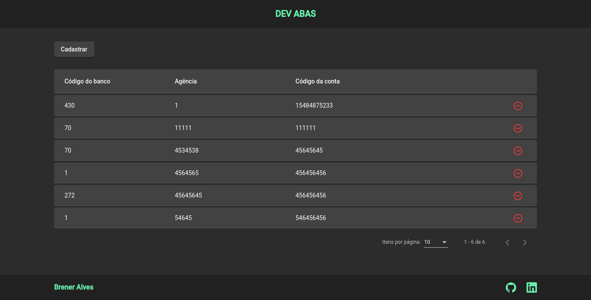
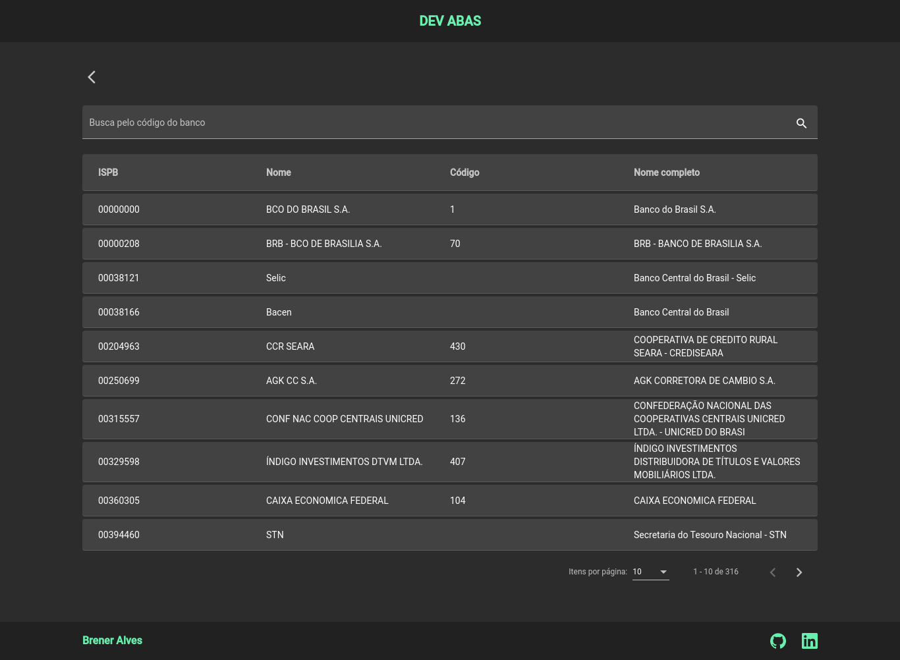
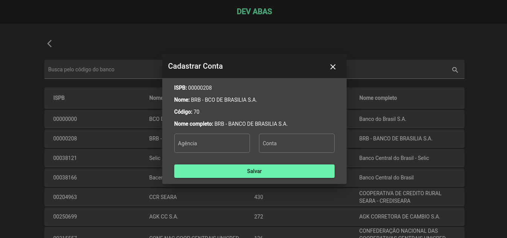

# DevAbas

Este projeto foi gerado com [Angular CLI](https://github.com/angular/angular-cli) versão 12.1.0.

<div align="center" >
  <h2 align="center">Tela inicial</h2>
  
  <br>
  <h2 align="center">Tela de listagem</h2>
  
  <br>
  <h2 align="center">Tela de cadastro</h2>
  
  <br>
</div>

## 🛠 Tecnologias

Esse projeto foi desenvolvido com as seguintes tecnologias:
- HTML
- SCSS
- JavaScript
- TypeScript
- Angular

## 📜 Projeto

O projeto tem por objetivo cadastrar contas bancárias pessoais. Utiliza a api pública: https://brasilapi.com.br/api/banks/v1 para listar e buscar os bancos, e armazena no local storage do dispositivo as contas cadastradas. Desenvolvido com a finalidade para teste e estudos.

### 📚 Pré-requisitos

Antes de começar, você vai precisar ter instalado em sua máquina as seguintes ferramentas:
[Git](https://git-scm.com), [Node.js](https://nodejs.org/en/), [Angular CLI](https://github.com/angular/angular-cli).
Além disto é bom ter um editor para trabalhar com o código como [VSCode](https://code.visualstudio.com/)

### ⚙️ Rodando o Web

```bash
# Clone este repositório
$ git clone https://github.com/Brenerr/dev-abas.git

# Acesse a pasta do projeto no terminal/cmd
$ cd dev-abas

# Instale as dependências
$ npm install

# Execute a aplicação em modo de desenvolvimento
$ ng server 

# Abra no seu navegador: `http://localhost:4200/`.
